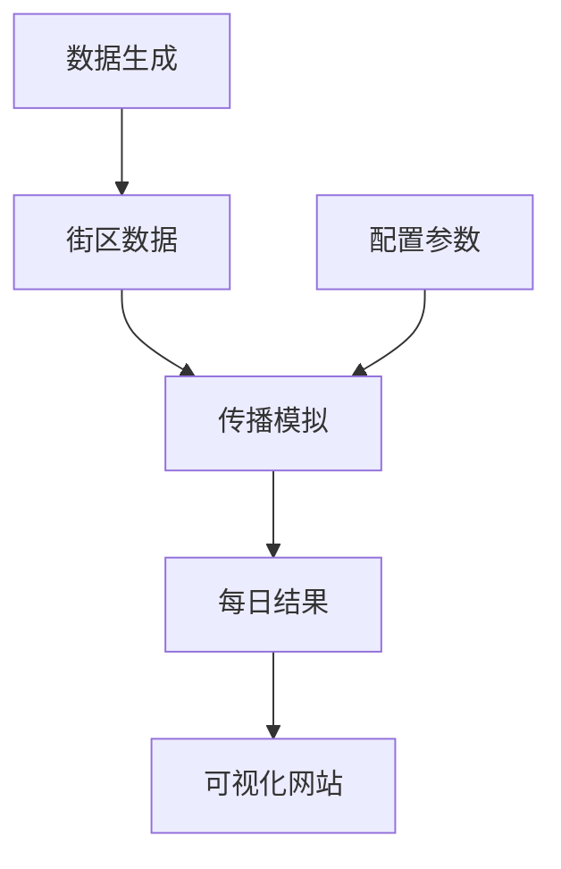

# USB病毒传播模拟系统

这个项目模拟了USB病毒在城市建筑物网络中的传播过程，结合了地理信息系统(GIS)、复杂网络理论和概率模型。

## 项目概述

该系统模拟了一种通过USB设备传播的病毒在城市环境中的扩散过程。项目包含以下核心组件：

1. **数据生成**：创建包含建筑物、人口和USB设备分布的虚拟城市环境
2. **传播模拟引擎**：基于人员流动网络实现病毒传播模型
3. **可视化系统**：生成交互式网站展示传播过程
4. **配置系统**：控制模拟参数和行为

## 系统架构



## 功能模块

| 模块 | 文件 | 功能描述 |
|------|------|----------|
| 数据生成 | `data_preparation.py` | 生成虚拟城市建筑物、人口和USB分布 |
| 模拟引擎 | `simulation_engine.py` | 实现病毒传播的核心逻辑 |
| 配置系统 | `config.py` | 定义模拟参数和行为网络 |
| 主程序 | `main.py` | 运行整个模拟流程 |
| 可视化 | `create_website.py` | 创建交互式结果展示网站 |

## 安装与运行

### 前置要求

- Python 3.8+
- 地理空间数据处理库

### 安装依赖

```bash
pip install -r requirements.txt
```

### 运行步骤

1. 生成街区数据：
```bash
python data_preparation.py
```

2. 运行传播模拟：
```bash
python main.py
```

3. 创建可视化网站：
```bash
python create_website.py
```

4. 启动网站服务器：
```bash
cd visualization/simulation_website
python -m http.server 8000
```

5. 在浏览器中访问：`http://localhost:8000`

## 配置参数

在`config.py`中可以调整以下关键参数：

- `usb_per_capita`: 人均USB设备数量
- `carry_rate`: USB携带率
- `spread_intensity`: 传播强度因子
- `cleanup_rate`: USB清理率
- `cleanup_interval`: 清理周期(天)
- `max_steps`: 最大模拟天数

## 项目结构

```
.
├── data/                          # 数据存储目录
│   ├── daily_results/             # 每日模拟结果
│   └── neighbourhood.geojson      # 街区基础数据
├── visualization/                 # 可视化相关
│   └── simulation_website/        # 生成的网站
├── data_preparation.py            # 数据生成脚本
├── simulation_engine.py           # 传播模拟引擎
├── config.py                      # 模拟参数配置
├── main.py                        # 主运行程序
├── create_website.py              # 网站生成脚本
└── requirements.txt               # Python依赖
```

## 技术细节

### 传播模型特点

1. **网络构建**：基于人员流动构建行为网络
2. **传播机制**：考虑USB携带率、感染比例和传播强度
3. **清理机制**：定期清理感染的USB设备
4. **衰减因子**：传播强度随时间衰减
5. **限制策略**：限制每个源节点的传播邻居数量

### 关键算法

```python
# 传播强度计算
infection_intensity = (
    edge_weight * 
    params['carry_rate'] * 
    src_infection_ratio * 
    params['spread_intensity'] * 
    time_factor
)

# 感染设备数计算
new_infections_count = np.random.binomial(
    max_infectable, 
    min(0.5, infection_intensity)
)
```

## 许可证

本项目采用 [MIT 许可证](LICENSE)。